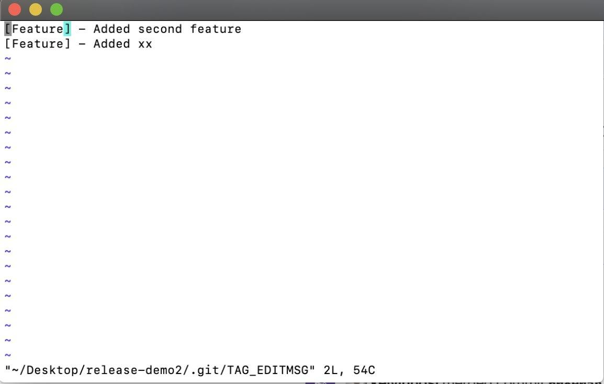
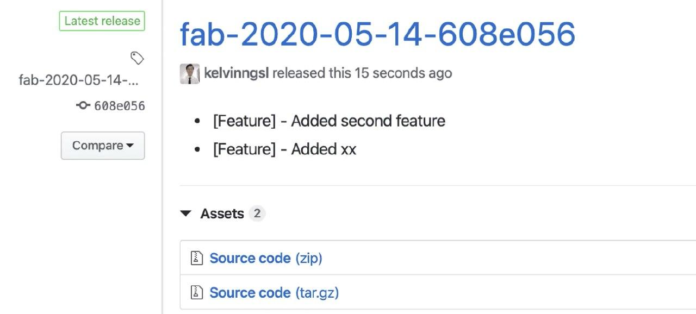
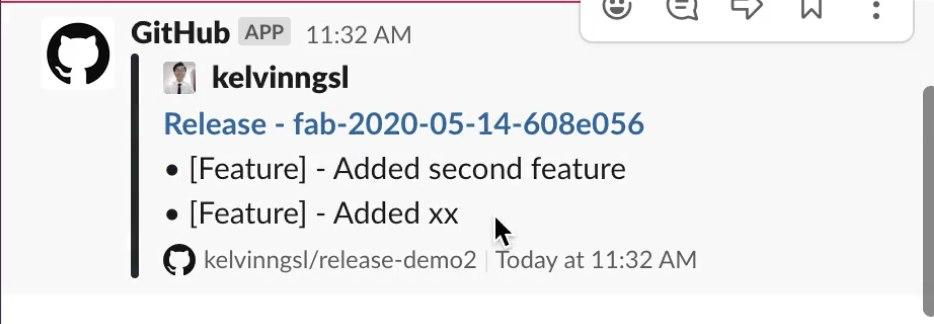

# Github Release Script


## Problem Statement
This script tackles the following problems:

1. The manual work of creating **Tags** and navigation of Github UI
2. Time consuming
3. What has changed? If each release cycle is long, releaser might not remember or even know what feature was added/changed


## Solution
This script provides the following features:

1. **Release Note** - Auto generation of Release Note based on Pull Requests made
2. **Edit** - Allowing Release Note to be edited before releasing
3. **Markdown** - Utilise markdown to make Release Note neater and readable
4. **GitHub x Slack** - Integration with Slack to notify team with nicely formatted Release Note


## Screenshots
Few photos that demostrates the use and result of this script

### 1. Editor Feature - This shows 2 Pull Requests of new features since last cycle


### 2. The latest release updated to GitHub


### 3. GitHub x Slack Integration


## Set Up
```bash
brew install hub
hub api # login to your github account
```

## Usage
```bash
bin/release # simple execution
```

## Built With

* Bash
* [Hub API](https://hub.github.com/hub-api.1.html)


## Authors

 **Kelvin** - [kelvinngsl](https://github.com/kelvinngsl)
